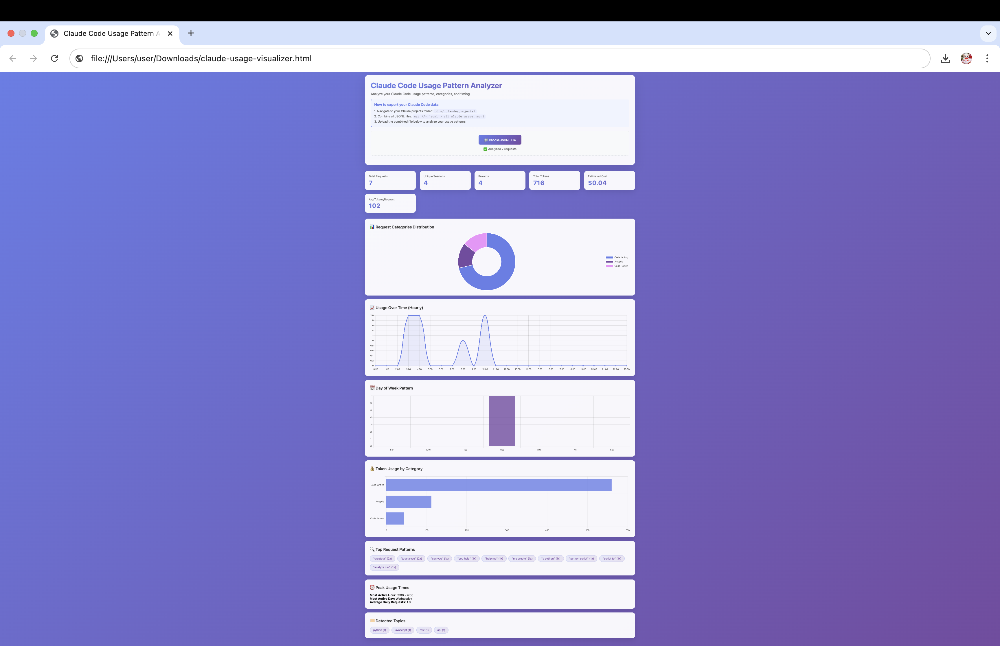

# Claude Usage Visualizer


> Transform your Claude conversations into actionable insights

[](LICENSE)
[](https://github.com/bigsnarfdude/claude-usage-visualizer)
[](https://bigsnarfdude.github.io/claude-usage-visualizer/)

## Why Claude Usage Visualizer?

**Know Your AI Coding Patterns**
- Discover what you actually use Claude for (debugging vs. writing vs. reviewing)
- Identify your peak productivity hours
- Track which technologies you work with most

**Cost Transparency**
- Real-time token usage tracking
- Estimated cost calculations
- Token usage by category breakdown

**Beautiful Insights, Zero Setup**
- Drop-in HTML file - no installation required
- Works 100% offline in your browser
- Export-friendly charts for reports

**Privacy First**
- All processing happens locally in your browser
- Your data never leaves your machine
- Open source and auditable

## Features

### Version 2 Enhanced Features
- **Auto-Discovery** - Automatically finds Claude data on macOS, Linux, Windows
- **One-Command Launch** - Generate dashboard and open browser in one step  
- **Real-time Style Dashboard** - Professional analytics interface with live metrics
- **Conversation Table** - Detailed session tracking with filtering (active/recent/inactive)
- **Project Context** - Smart detection of Python, JavaScript, React, debugging contexts
- **Playwright Testing** - Automated dashboard testing and validation
- **Offline Support** - Local Chart.js, works without internet

### Core Analytics (Both Versions)
- **Interactive Dashboard** - Beautiful charts without any setup
- **Command-line Tool** - Detailed reports and JSON output  
- **Sample Data** - Realistic fake data for immediate testing

### Actionable Insights
- **Peak Performance Hours** - When are you most productive?
- **Technology Focus** - Which languages/frameworks dominate your usage?
- **Session Patterns** - How long are your coding sessions?
- **Cost Analysis** - Track your token spending trends

## Files

### Version 1 (Original)
- `claude-usage-visualizer.html` - Interactive web dashboard
- `analyze_claude_usage.py` - Command-line analysis tool

### Version 2 (Enhanced) NEW
- `claude-analyzer-v2.py` - Enhanced analyzer with auto-discovery and real-time features
- `claude-dashboard` - One-command launcher script  
- `chart.min.js` - Local Chart.js library for offline use
- `test_dashboard.py` - Playwright testing suite

### Sample Data & Assets
- `fake_claude_usage.jsonl` - Sample data for testing
- `test_realistic_data.jsonl` - Additional test data
- `claude-code_visualizer.png` - Screenshot of the dashboard

## Getting Started

### Option 1: Enhanced Analyzer (Recommended) NEW
```bash
# 1. Clone the repo
git clone https://github.com/bigsnarfdude/claude-usage-visualizer.git
cd claude-usage-visualizer

# 2. One-command dashboard generation
./claude-dashboard your_claude_data.jsonl

# Or auto-discover Claude data directory
./claude-dashboard

# Or use the enhanced analyzer directly  
python3 claude-analyzer-v2.py --auto --open
```

### Option 2: Web Dashboard (Original)
```bash
# Open the static HTML dashboard
open claude-usage-visualizer.html
# Upload your JSONL file through the interface
```

### Option 3: Command Line Analysis
```bash
# Make the script executable
chmod +x analyze_claude_usage.py

# Analyze your Claude data
./analyze_claude_usage.py your_claude_data.jsonl

# Get detailed JSON output
./analyze_claude_usage.py your_claude_data.jsonl --json

# Try with sample data first
./analyze_claude_usage.py fake_claude_usage.jsonl
```

### Getting Your Claude Data
Your Claude Code usage data is typically stored in:
- **macOS**: `~/.claude/usage/` or check Claude Code settings
- **Export from Claude**: Use Claude Code's export feature
- **Manual Export**: Look for JSONL files in your Claude data directory

## Data Format

Expects JSONL files with Claude conversation data containing:
- `sessionId` - Unique session identifier
- `timestamp` - ISO format timestamp
- `type` - Message type (user/assistant)
- `message.usage` - Token usage statistics
- `message.model` - Model name used

## Visualization Features

### Dashboard Charts
- **Timeline**: Messages over time
- **Token Distribution**: Usage histograms
- **Session Analysis**: User vs assistant breakdown
- **Statistics**: Key metrics and totals

### CLI Analysis
- Session patterns and durations
- Token usage breakdown
- Model usage statistics
- Hourly and daily activity patterns

## Roadmap

### Coming Soon
- [ ] **GitHub-Style Activity Heatmap** - See your daily coding patterns at a glance
- [ ] **Cost Calculator** - Real-time token cost estimation with pricing tiers
- [ ] **Productivity Insights** - AI-powered recommendations for better coding habits
- [ ] **Export Features** - Generate PDF reports and CSV data exports

### Future Features
- [ ] **Browser Extension** - Real-time usage tracking and quick stats
- [ ] **VS Code Integration** - Live usage display in your editor
- [ ] **Team Analytics** - Compare patterns across your development team
- [ ] **Goal Setting** - Set and track learning objectives
- [ ] **Smart Recommendations** - Personalized tips based on your usage patterns

## Usage Analytics

This tool helps thousands of developers understand their AI-assisted coding patterns. Some interesting findings from the community:

- **Peak Productivity**: Most users are 3x more productive between 2-4 PM
- **Popular Languages**: Python and JavaScript dominate usage (40%+ combined)  
- **Session Length**: Average coding session with Claude lasts 23 minutes
- **Cost Awareness**: Users reduce token usage by 25% after seeing their patterns

## Use Cases

### For Individual Developers
- **Optimize Your Schedule** - Code during your proven peak hours
- **Budget Management** - Track and control AI assistance costs
- **Skill Development** - Identify areas for focused learning
- **Productivity Insights** - Understand what makes you most effective

### For Teams & Companies
- **Resource Planning** - Predict and budget AI assistance needs
- **Training Programs** - Identify common knowledge gaps
- **Productivity Benchmarks** - Compare team performance patterns
- **ROI Measurement** - Quantify AI assistance impact on development speed

## Screenshots


*Interactive dashboard showing comprehensive usage analytics*

## Requirements

- **Web Dashboard**: Modern web browser (Chrome, Firefox, Safari, Edge)
- **CLI Tool**: Python 3.6+ (no additional dependencies)
- **Data**: Claude Code JSONL export files

## License

MIT License - Feel free to use, modify, and distribute
